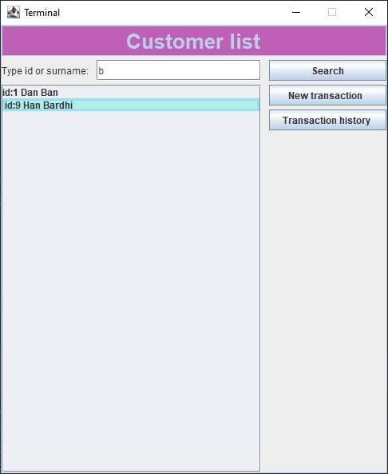
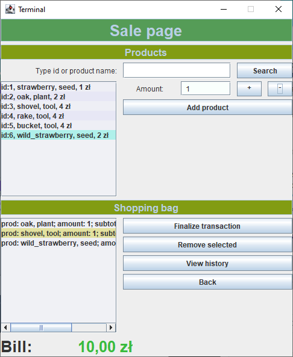
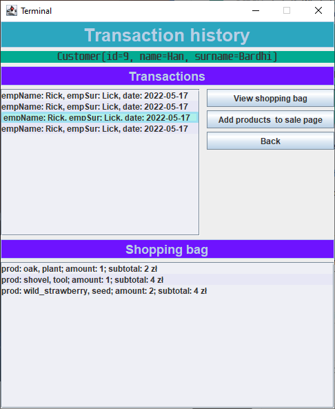
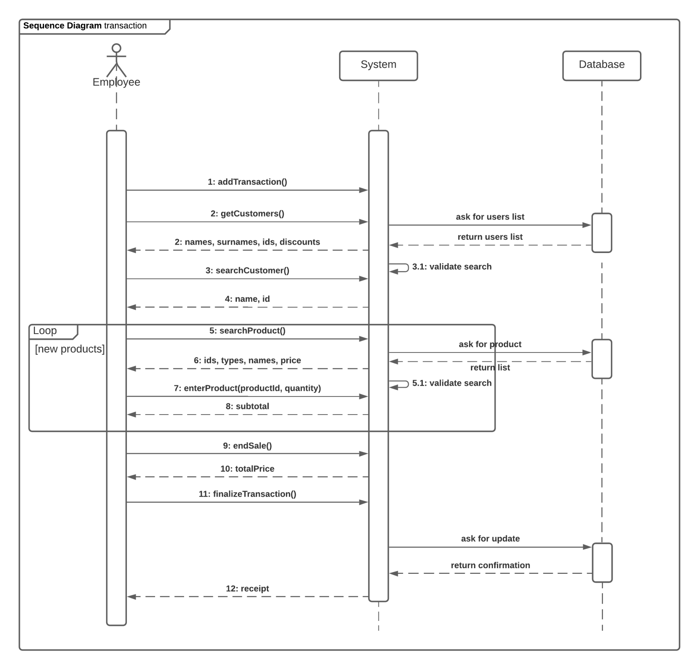

# GardeningCenter

Spring and gui project. 

* Design

  Gardening Center is an application that would be provided along with the cashier terminal that can display the history of the customers transactions, help making new sales and updating them to the database. Users can use it to keep track of information's about stored products, deliveries, customers and employees.
  
  

* Graphical user interface
  
    
  
  Gui for the cashier terminal used by an employee of the Garden Center. The employee can search for customers in the database by the customer's id or last name. An employee can view a customer's transaction history, view old shopping bags and products from old transactions, and add them to current sales. The employee can search for products available in the database and create a new sale. The employee selects the customer, creates a new transaction, and assigns products to that transaction. The finalized transaction is stored in the database. The employee can view the transaction history of the selected customer, search for specific transactions, display the customer's shopping bags.
  
  
    
