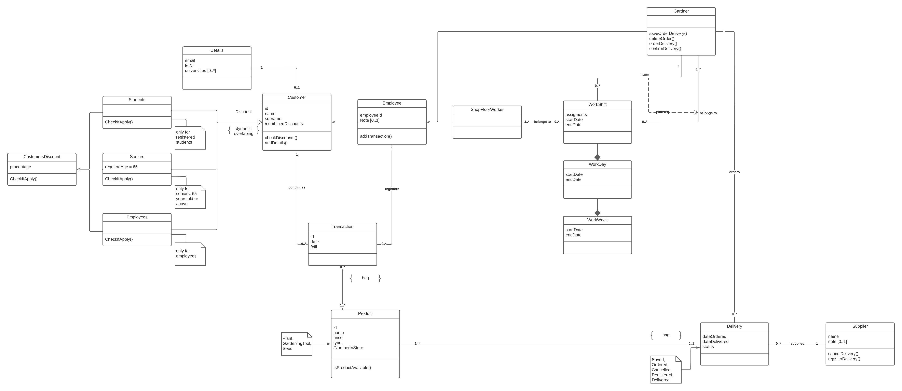

# GardeningCenter

Spring and gui project. 

* Design

  Gardening Center is an application that would be provided along with the cashier terminal that can display the history of the customers transactions, help making new sales and updating them to the database. Users can use it to keep track of information's about stored products, deliveries, customers and employees.
  
  

* Graphical user interface

  Gui designed for the cashier terminal used by Gardening Center employee. Employee can search customers in the database using customer’s id or surname. Employee can view history of customer’s transactions, view old shopping bags and products from old transactions and add them to the current sale. Employee can search products available in the database and create a new sale. Employee selects a customer, creates a new transaction and assigns products to that transaction. Finalized transaction is stored in the database. Employee can study history of transactions of the selected customer, search for specific transactions, display customer’s shopping bags.
